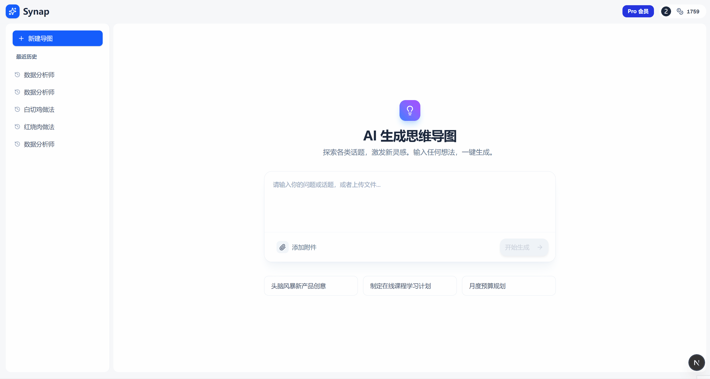
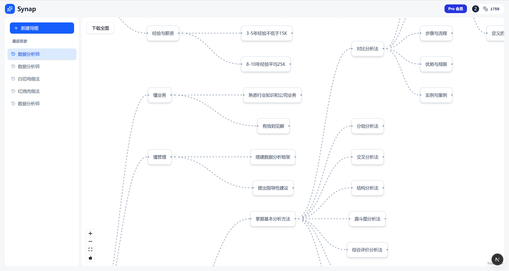

<div align="center">

# 🧠 AI Synap SaaS

<!-- 语言切换区 -->
[English](./README.md) | **简体中文**

<!-- Banner 图片 -->


</div>

# 🧠 AI Synap SaaS - 下一代智能思维导图平台

<div align="center">


</div>

> **一个达到生产级标准的 AI 思维导图产品，基于 Next.js 15、DeepSeek 与 ReactFlow 构建。**
>
> *对标行业头部产品（如 Mapify），实现了“流式生成”、“无限节点扩写”以及完整的商业化闭环（支付/积分系统）。*




<details>
<summary>💳 点击查看测试信用卡信息 (Test Cards for Stripe)</summary>

<br>

> **💳 测试说明:**
>
> *   本项目处于 Stripe Test Mode (沙盒模式)。
> *   请勿使用真实信用卡支付。
> *   **测试卡号:** `4242 4242 4242 4242`
> *   **日期:** 任意未来日期 (如 12/30)
> *   **CVC:** 任意 (如 123)

</details>

## ✨ 项目概述

这是一个全栈 **AI SaaS 应用**，旨在利用大语言模型（DeepSeek）将非结构化的文本、PDF、Word 文档瞬间转化为结构清晰、可交互的思维导图。

不同于简单的 API 套壳，本项目自主研发了 **流式图引擎（Streaming Graph Engine）**，能够在 AI 思考的同时逐个渲染节点，解决了流式传输中常见的 JSON 解析错误和画布闪烁问题。此外，项目内置了基于 Stripe 和 Supabase 的**商业化积分系统**，支持分层订阅（免费/Pro/无限版），开箱即用。

## 🚀 核心功能亮点

### 🎨 极致的 AI 交互体验
*   **流式生成 (Streaming Rendering):** 结合 `Vercel AI SDK` 与 `useObject` 钩子，实现节点逐个生成的丝滑视觉效果，无需等待 AI 完整输出。
*   **无限节点扩写 (Infinite Expansion):** 用户点击任意节点的 "+" 号，AI 将基于上下文自动发散出子节点，支持无限层级头脑风暴。
*   **智能自动布局:** 定制的 DAGRE 算法引擎，根据节点文本长度动态计算宽高与间距，确保导图永远整洁美观。
*   **多模态文件解析:** 支持上传 PDF、Word、TXT 文件（最高支持 10MB），后端自动解析并提取核心内容生成导图。

### 💰 完整的 SaaS 商业化闭环
*   **分层订阅系统:**
    *   **Basic (免费版):** 体验额度，限制文件大小 (2MB)，导出带全屏水印。
    *   **Pro (会员版):** 大额积分，支持 10MB 文件，高清无水印导出，解锁无限扩写。
    *   **Unlimited (无限版):** 无限积分与无限制使用。
*   **动态计费策略:** 摒弃“按次扣费”的不公，采用 **“基础费 + 字符流量费”** 的算法，精准计算 Token 成本，保障利润空间。
*   **Stripe 深度集成:** 支持完整的 Checkout 流程与 Webhook 处理，实现自动充值、会员自动续费、每月积分重置。
*   **实时权益同步:** 支付成功后，利用 Supabase Realtime 和自定义事件总线，前端无需刷新即可秒级更新用户权益（VIP 标、积分余额）。

### 🛠️ 现代化 UI/UX
*   **高性能画布:** 基于 `@xyflow/react` (ReactFlow v12)，轻松承载数百个节点操作不卡顿。
*   **商业级导出:** 支持导出高清 PNG，针对免费用户自动添加防盗全屏水印。
*   **响应式设计:** 完美适配移动端与桌面端，采用 Shadcn/UI 构建的现代化界面。

## 🏗️ 技术栈

| 类别           | 技术选型                                              |
| :------------- | :---------------------------------------------------- |
| **全栈框架**   | Next.js 15 (App Router), TypeScript, React 19         |
| **样式与UI**   | Tailwind CSS, Shadcn/UI, Lucide React, Framer Motion  |
| **AI 模型**    | DeepSeek V3 API, Vercel AI SDK (@ai-sdk/react)        |
| **图形可视化** | ReactFlow v12, Dagre (自动布局算法), html-to-image    |
| **后端与数据** | Supabase (PostgreSQL, Auth, Realtime), Edge Functions |
| **支付系统**   | Stripe API, Stripe Webhooks                           |
| **文件处理**   | pdf2json, mammoth.js                                  |

## 💡 技术难点与解决方案

### 1. DeepSeek JSON 模式兼容性攻坚
**痛点:** DeepSeek API 在流式输出时与 Vercel SDK 的 Strict Mode 存在兼容问题，常导致 JSON 解析中断。
**方案:** 编写底层 `fetch` 拦截器，动态注入 JSON Schema 约束，并强制重写 `response_format` 参数，确保流式输出 100% 符合前端渲染器的 JSON 结构要求。

### 2. 复杂状态下的“闭包陷阱”处理
**痛点:** 在 ReactFlow 的回调函数中（如节点扩写），无法获取最新的用户会员状态（User Tier），导致用户升级后仍被拦截。
**方案:** 采用 `useRef` + `useEffect` 同步模式设计自定义 Hook，确保在任何闭包环境下都能读取到内存中最新的用户权益状态，彻底解决状态滞后问题。

### 3. 公平且安全的动态计费系统
**痛点:** 若按次扣费，用户上传 10MB 书籍和输入一句话扣费一样，会导致成本倒挂；若生成后扣费，存在用户余额不足“白嫖”算力的风险。
**方案:** 设计预计算算法：`预估消耗 = 基础分 + (字符数 / 500)`。在请求 AI 前先进行余额预扣除检查，精确到 Token 级别的成本控制，实现了真正的商业公平性。

### 4. 全屏防盗水印的动态渲染
**痛点:** 普通水印容易被截掉，且 Canvas 截图时坐标偏移难处理。
**方案:** 开发了覆盖全视口的 DOM 遮罩层，利用 CSS Grid 布局生成倾斜 45 度的密集文字矩阵。在执行截图瞬间动态挂载该层，截图完成后自动卸载，彻底防止免费用户去除水印。

## 🗄️ 数据库设计 (Supabase)

项目使用 PostgreSQL 构建了严谨的用户数据模型：

*   **`profiles`**: 存储用户核心权益（积分 `credits`、等级 `tier`、Stripe ID、账单周期、上次重置时间）。
*   **`mind_maps`**: 存储思维导图的 JSON 数据结构，支持历史记录回溯。
*   **Auth Triggers**: 数据库触发器，确保新用户注册时自动初始化积分和权限，无需后端额外代码介入。

## 🚀 本地运行指南

1.  **克隆项目**
    ```bash
    git clone https://github.com/monsterxwx/synap.git
    ```

2.  **安装依赖**
    ```bash
    npm install
    # 或
    pnpm install
    ```

3.  **配置环境变量**
    在根目录创建 `.env.local` 文件，填入以下密钥：
    ```
    DEEPSEEK_API_KEY=
    NEXT_PUBLIC_SUPABASE_URL=
    NEXT_PUBLIC_SUPABASE_ANON_KEY=
    NEXT_PUBLIC_STRIPE_PUBLISHABLE_KEY=
    STRIPE_SECRET_KEY=
    NEXT_PUBLIC_APP_URL=http://localhost:3000
    STRIPE_WEBHOOK_SECRET=
    SUPABASE_SERVICE_ROLE_KEY=
    ```

4.  **启动开发服务器**
    ```bash
    npm run dev
    ```

## 🤝 联系我 / 合作

我是一名专注于构建高复杂 AI Web 应用的**全栈开发者**。
在 **Next.js 生态**、**LLM 大模型落地**、**SaaS 架构设计**及**支付系统集成**方面拥有丰富的实战经验。

如果您正在寻找开发者帮助您构建 MVP、SaaS 产品或进行技术升级，欢迎联系我：

*   **邮箱:** [623989195@qq.com]
*   **个人主页/作品集:** [https://monsterxwx.github.io/blog/]

---
